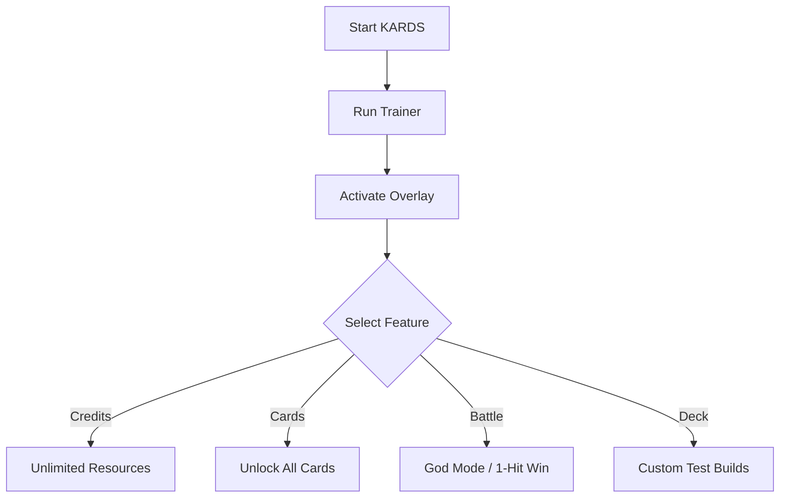

# 🪖 KARDS – The WWII Card Game Trainer

**KARDS – The WWII Card Game** combines deep deck-building with the history of World War II, where every move can turn the tide of battle. But grinding for credits, waiting for card unlocks, and replaying matches can slow down the fun. The **KARDS Trainer** solves this—giving you control over resources, decks, and battles for quicker experimentation and endless creativity.

---

## 🔎 Overview

This trainer is built for players who want to:

* Unlock new cards instantly without long grind
* Experiment with unlimited deck variations
* Gain infinite resources for testing strategies
* Skip repetitive battles with faster outcomes
* Focus on tactics instead of farming currency

Perfect for both casual players exploring decks and strategists testing competitive lineups.

---

## ⚙️ Core Features

* **💰 Unlimited Credits** – Build any deck without resource limits.
* **🃏 Instant Card Unlocks** – Access rare or event cards instantly.
* **⚡ Battle Boosts** – Accelerate match flow and reduce grind.
* **🛡 Invulnerability Toggle** – Protect your HQ from destruction.
* **🎯 One-Hit Victory** – End routine matches instantly.
* **🎛 Custom Hotkeys** – Bind your favorite functions to any keys.

[!NOTE]
The trainer works **offline and client-side only**—safe for sandbox testing and casual play.

---

## 🖥 Compatibility

| Platform        | Support | Notes                             |
| --------------- | ------- | --------------------------------- |
| Windows 10/11   | ✅       | Fully supported                   |
| Steam Edition   | ✅       | Recommended                       |
| Other Launchers | ⚠️      | Manual path setup may be required |
| Mac/Linux       | ❌       | Not supported                     |

---

## ⚡ Setup Instructions

1. Download and extract the trainer package.
2. Launch **KARDS – The WWII Card Game**.
3. Run `kards_trainer.exe` as Administrator.
4. Press `F8` to open the in-game trainer overlay.
5. Toggle cheats with hotkeys or via the UI panel.

```bash
# Example quick run
kards_trainer.exe --overlay --credits --unlock
```

---

## 📊 Trainer Workflow



---

## ❓ FAQ

**Q: Can this trainer unlock premium cards?**
A: Yes, all cards can be accessed instantly.

**Q: Will my saves or decks be corrupted?**
A: No—trainer changes are reversible and safe.

**Q: Does it work in online ranked matches?**
A: No, it’s built for offline and testing use only.

**Q: Can I change hotkeys?**
A: Yes, all functions are fully remappable.

---

## 🚀 Final Thoughts

The **KARDS Trainer** gives you freedom to build decks, test strategies, and play without restrictions. Whether you’re exploring WWII factions, trying new combos, or cutting grind, this trainer makes KARDS smoother and more fun.

---
